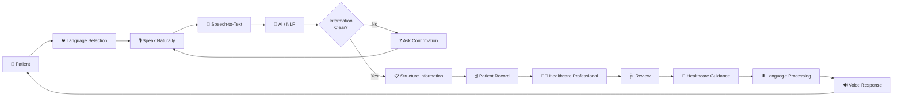
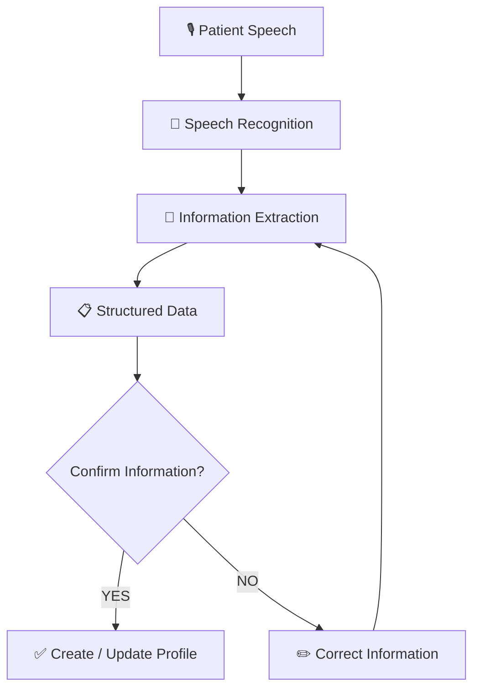
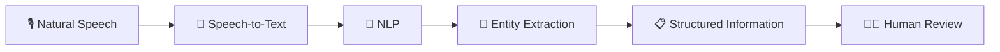
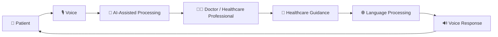
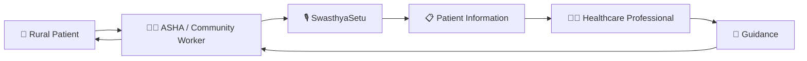
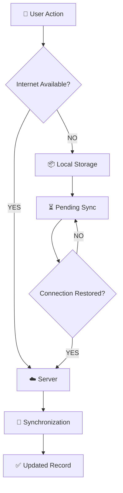
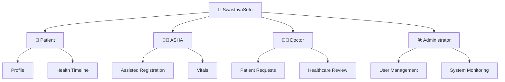
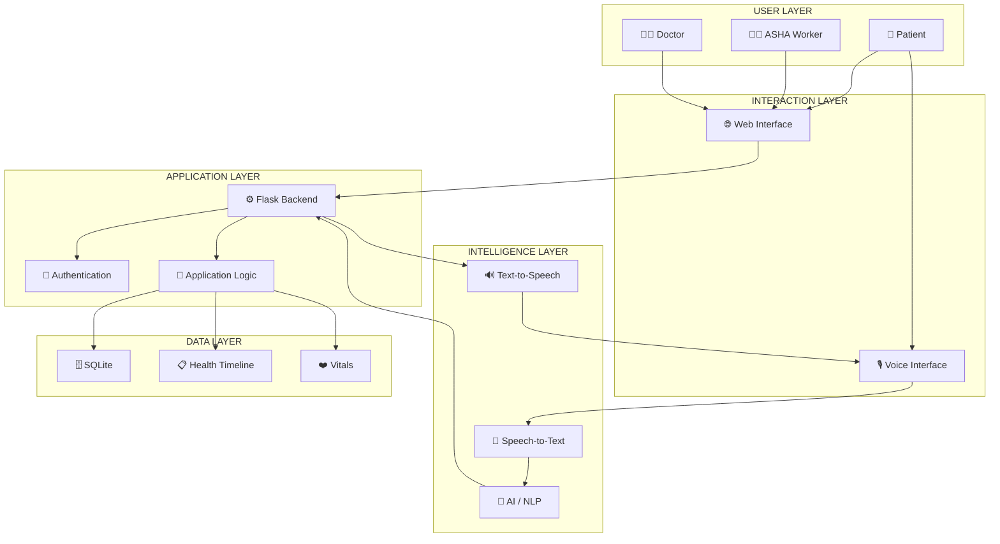

<div align="center">

<a href="https://github.com/anshika-dev23/Swasthya-Setu">

</a>

# 🌾 SwasthyaSetu

### Smart Voice-First Rural Healthcare Platform

<p>
<strong>Listen • Understand • Connect • Care</strong>
</p>

<p>
Bridging the communication gap between rural communities and healthcare professionals through accessible technology.
</p>

<br>


<br><br>

</div>

---

# 🌾 About SwasthyaSetu

**SwasthyaSetu** is a **Smart Voice-First Rural Healthcare Platform** designed to make digital healthcare communication simpler, more accessible and more inclusive for rural communities.

The platform focuses on a fundamental problem:

> **Healthcare technology is useful only when the people who need it can actually use it.**

Many patients may not be comfortable with:

- Typing long messages
- Reading complicated interfaces
- Understanding medical terminology
- Speaking formal or standardized language
- Navigating multiple digital screens

SwasthyaSetu therefore explores a **voice-first interaction model** where patients can communicate naturally and healthcare professionals can receive structured information.

---

<div align="center">

## 🎙️ The Core Idea

### **Patient ki language mein suno → samjho → doctor tak pahunchao → doctor ki advice patient ki language mein wapas samjhao.**

</div>

---

# 🚨 01. Problem Statement

Rural communities can face multiple barriers when accessing timely and organized healthcare.

The challenge is not limited to the physical availability of hospitals.

It can also involve:

| Problem | Challenge |
|---|---|
| 🏥 Limited doctors | Specialists may not always be easily accessible |
| 🛣️ Long distance | Healthcare facilities may require significant travel |
| 📶 Poor connectivity | Internet-dependent systems may become difficult to use |
| 📱 Low digital literacy | Complex applications may discourage users |
| ⌨️ Typing difficulty | Patients may struggle to describe symptoms through text |
| 🗣️ Language barriers | Formal language may differ from everyday speech |
| 🎙️ Accent variations | Speech recognition may struggle with local accents |
| 📋 Fragmented records | Patient information may not be organized |
| 💊 Prescription confusion | Dosage and precautions may be difficult to understand |
| ⏰ Missed follow-ups | Important healthcare instructions may be forgotten |

---

# 🎯 02. The Real Design Challenge

The question is not simply:

> **"Can we build another healthcare application?"**

The bigger question is:

> **"Can a person with limited digital literacy actually use it comfortably?"**

This leads to the core design principle of SwasthyaSetu:

```text
Technology should adapt to the patient
                ↓
        NOT the patient
                ↓
       adapt to technology
```

---

# 💡 03. Proposed Solution

SwasthyaSetu introduces a **voice-first healthcare communication layer**.

Instead of forcing users to type complicated descriptions, the platform is designed around natural voice interaction.

### Basic concept

```text
🎙️ SPEAK
   ↓
📝 CONVERT
   ↓
🧠 UNDERSTAND
   ↓
📋 STRUCTURE
   ↓
👨‍⚕️ CONNECT
   ↓
💬 RESPOND
   ↓
🔊 SPEAK BACK
```

The system can help transform natural speech into structured information that can be reviewed by healthcare professionals.

---

# 🔄 04. Complete Patient Flow



---

# 🎙️ 05. Voice-First Patient Registration

Traditional healthcare applications often depend on forms.

SwasthyaSetu explores a simpler interaction:

### Patient says:

> **"Mera naam Ram Kumar hai, meri age 52 saal hai aur main Barabanki ke ek gaon mein rehta hoon."**

The system can extract:

```text
Name
↓
Ram Kumar

Age
↓
52

Location
↓
Barabanki
```

The extracted information can then be presented for confirmation.



### Important principle

> **If the system is uncertain about important information, it should ask instead of silently assuming.**

---

# 🩺 06. Voice-Based Health Complaint

Patients can describe their symptoms naturally.

### Example

> **"Mujhe teen din se bukhar hai aur raat mein bahut zyada thand lagti hai."**

The platform can organize the information as:

```text
Complaint
   ↓
Fever

Duration
   ↓
3 Days

Additional Information
   ↓
Chills at night
```

The purpose is to improve **communication and information organization**.

It is not intended to independently diagnose the patient.

---

# 🌐 07. Regional Language & Accent Support

Real-world communication is diverse.

SwasthyaSetu is designed with future support for:

- 🇮🇳 Hindi
- Regional languages
- Local accents
- Mixed-language speech
- Everyday vocabulary
- Common pronunciation variations

For example:

```text
"Dawai"
"Dawa"
"Medicine"
```

can potentially be normalized into the same general concept.

Similarly:

```text
"Sugar"
"Shugar"
"Suggar"
```

can be processed as possible speech variations depending on context.

---

# 🧠 08. AI-Assisted Information Structuring

AI can act as an **information-processing layer** between natural speech and structured healthcare records.



Possible information categories include:

- Patient details
- Symptoms
- Duration
- Location
- Medicines
- Follow-up information
- Appointment information
- Vitals

---

# 👨‍⚕️ 09. Human-in-the-Loop Healthcare

SwasthyaSetu is designed around a **human-in-the-loop model**.

AI can assist with:

- Understanding speech
- Structuring information
- Language processing
- Organizing patient information

Healthcare professionals remain involved in medical decision-making.



---

# 🔊 10. Voice Response

Healthcare instructions can potentially be converted into a patient-friendly voice response.

```text
👨‍⚕️ Healthcare Professional
             ↓
       Healthcare Guidance
             ↓
      Language Processing
             ↓
       Text-to-Speech
             ↓
          🔊 Voice
             ↓
        👤 Patient
```

Potential applications:

- Medicine instructions
- Dosage information
- Precautions
- Follow-up instructions
- Appointment information

---

# 📋 11. Digital Health Timeline

SwasthyaSetu can organize healthcare interactions chronologically.

```text
┌─────────────────────────────────────┐
│          HEALTH TIMELINE            │
├─────────────────────────────────────┤
│                                     │
│ 📅 Registration                     │
│ Patient profile created             │
│                                     │
│              ↓                      │
│                                     │
│ 📅 Health Complaint                 │
│ Patient-reported symptoms           │
│                                     │
│              ↓                      │
│                                     │
│ 📅 Vitals                           │
│ Basic measurements recorded         │
│                                     │
│              ↓                      │
│                                     │
│ 📅 Healthcare Review                │
│ Professional reviews information   │
│                                     │
│              ↓                      │
│                                     │
│ 📅 Follow-up                        │
│ Future healthcare interaction       │
│                                     │
└─────────────────────────────────────┘
```

---

# ❤️ 12. Vitals Monitoring

The current prototype includes basic vitals recording.

| Vital | Example |
|---|---:|
| 🌡️ Temperature | 38.5°C |
| ❤️ Pulse | 82 BPM |
| 🫁 SpO₂ | 97% |
| 🩸 Blood Pressure | 120/80 |
| ⚖️ Weight | 60 kg |

The platform can display simple status indicators for easier interpretation.

> **Vitals indicators are informational and do not replace professional medical assessment.**

---

# 👩‍⚕️ 13. ASHA / Community Health Worker Layer

Community health workers can act as an important bridge for users who may need assistance with digital healthcare.



Potential workflows:

- Assisted registration
- Vitals recording
- Patient support
- Follow-up assistance
- Healthcare communication

---

# 📶 14. Offline-Resilient Architecture

Rural connectivity can vary.

A future version of SwasthyaSetu can support local data storage and synchronization.



---

# 🔐 15. Security & Privacy

Healthcare information is sensitive.

Security is therefore considered part of the platform architecture.

### Planned security components

- 🔐 Authentication
- 👥 Role-based access control
- 🛡️ Protected patient records
- 🔑 Secure credentials
- 📜 Activity logging
- 🔒 Controlled access
- 🧹 Controlled handling of voice data

### Role architecture



---

# 🏗️ 16. System Architecture



---

# 🧩 17. Feature Architecture

```text
                         🌾 SWASTHYASETU
                               │
        ┌──────────────────────┼──────────────────────┐
        │                      │                      │
        ▼                      ▼                      ▼
    🎙️ VOICE              🏥 HEALTHCARE          🧠 AI
        │                      │                      │
   ┌────┼────┐            ┌────┼────┐            ┌────┼────┐
   │    │    │            │    │    │            │    │    │
  STT  TTS  Language     ASHA Doctor Records   NLP Intent Entity
        │                      │                      │
        └──────────────────────┼──────────────────────┘
                               │
                               ▼
                        🌾 RURAL ACCESS
```

---

# ✨ 18. Key Features

| Feature | Purpose |
|---|---|
| 🎙️ Voice Interaction | Natural communication |
| 👤 Patient Registration | Structured patient profiles |
| 🩺 Health Complaints | Record patient concerns |
| ❤️ Vitals | Store basic health measurements |
| 📋 Health Timeline | Organize patient history |
| 👩‍⚕️ ASHA Support | Assisted healthcare workflows |
| 👨‍⚕️ Doctor Connectivity | Healthcare professional review |
| 🌐 Language Support | Improve accessibility |
| 📶 Offline Architecture | Handle connectivity limitations |
| 🔐 Security | Protect sensitive information |
| 🧠 AI Assistance | Structure natural-language information |

---

# 🛠️ 19. Technology Stack

| Layer | Technology |
|---|---|
| 🎨 Frontend | HTML5 • CSS3 • JavaScript |
| ⚙️ Backend | Python • Flask |
| 🗄️ Database | SQLite |
| 🧠 AI Layer | AI / NLP |
| 🎙️ Voice | Speech-to-Text |
| 🔊 Output | Text-to-Speech |
| 🔐 Security | Authentication • RBAC |
| 📱 Future | PWA • Offline-first |
| ☁️ Deployment | Cloud-ready architecture |

---

# 📂 20. Project Structure

```text
Swasthya-Setu/
│
├── app.py
├── database.py
├── database.db
├── requirements.txt
├── README.md
├── .gitignore
│
├── assets/
│   └── swasthya-setu-logo.svg
│
├── templates/
│   ├── index.html
│   ├── register.html
│   ├── patients.html
│   ├── patient_details.html
│   └── vitals.html
│
├── static/
│   ├── css/
│   │   └── style.css
│   │
│   ├── js/
│   │   └── script.js
│   │
│   └── images/
│
└── screenshots/
    ├── dashboard.png
    ├── patient-registration.png
    ├── vitals.png
    ├── health-timeline.png
    └── voice-interface.png
```

---

# ✅ 21. Current Implementation

### Implemented

- [x] Flask application setup
- [x] SQLite database
- [x] Patient registration
- [x] Patient listing
- [x] Patient details
- [x] Vitals recording
- [x] Vitals database
- [x] Smart vitals status
- [x] Basic health timeline
- [x] Patient record management

### In Development

- [ ] Voice-based registration
- [ ] Voice health complaints
- [ ] Speech-to-text
- [ ] Text-to-speech
- [ ] Regional language support
- [ ] Doctor dashboard
- [ ] ASHA workflow
- [ ] Appointments
- [ ] Prescriptions
- [ ] Authentication
- [ ] Offline synchronization
- [ ] AI-assisted information extraction

---

# 🚧 22. Development Roadmap

## Phase 01 — Foundation

```text
Flask
  ↓
SQLite
  ↓
Patient Records
  ↓
Vitals
  ↓
Health Timeline
```

## Phase 02 — Voice Layer

```text
Microphone
  ↓
Speech-to-Text
  ↓
Language Processing
  ↓
Structured Information
```

## Phase 03 — Healthcare Connectivity

```text
Patient
  ↓
SwasthyaSetu
  ↓
ASHA / Doctor
  ↓
Healthcare Guidance
```

## Phase 04 — Intelligence

```text
Speech
  ↓
NLP
  ↓
Entity Extraction
  ↓
Confidence Detection
  ↓
Confirmation
```

## Phase 05 — Scale

```text
Offline Mode
      ↓
PWA
      ↓
Secure Cloud
      ↓
Scalable Healthcare Platform
```

---

# 🧪 23. Example Interaction

### 👤 Patient

> **"Mujhe teen din se bukhar hai aur raat mein bahut thand lagti hai."**

### 🧠 SwasthyaSetu

```text
Detected Complaint
        ↓
Fever

Duration
        ↓
3 Days

Additional Information
        ↓
Chills at night
```

### 👨‍⚕️ Healthcare Professional

Reviews the available information.

### 💬 Healthcare Guidance

Appropriate guidance is provided by the healthcare professional.

### 🔊 SwasthyaSetu

The response can be converted into a patient-friendly voice interaction.

---

# 🎨 24. Design Philosophy

## 🎙️ Voice First

Reduce dependence on typing.

## 🌐 Accessibility First

Consider language, literacy, device and connectivity limitations.

## 👨‍⚕️ Human in the Loop

AI assists communication rather than independently replacing healthcare professionals.

## ❓ Confirm, Don't Assume

Uncertain important information should trigger confirmation.

## 🌾 Rural First

The interface should consider real-world rural usage conditions.

---

# 🌱 25. Future Vision

SwasthyaSetu can evolve from a healthcare management prototype into a broader rural healthcare communication ecosystem.

```mermaid
mindmap

root((🌾 SwasthyaSetu))

  🎙️ Voice Healthcare
    Speech Recognition
    Text-to-Speech
    Regional Languages
    Accent Awareness

  👨‍⚕️ Healthcare
    Doctor Dashboard
    ASHA Support
    Appointments
    Follow-ups
    Prescriptions

  🧠 Intelligence
    NLP
    Entity Extraction
    Intent Recognition
    Confidence Detection

  📶 Accessibility
    Offline Mode
    PWA
    Low Bandwidth
    Simple UI

  🔐 Security
    Authentication
    RBAC
    Secure Records
    Audit Logs
```

---

# 📸 26. Screenshots

> Add real application screenshots here as the project develops.

### 🏠 Dashboard


### 👤 Patient Registration


### ❤️ Vitals


### 📋 Health Timeline


### 🎙️ Voice Interface


---

# 🎥 27. Demo Flow

```text
                 🌾 SWASTHYASETU DEMO

                         │
                         ▼
                    👤 Patient
                         │
                         ▼
                 🎙️ Press Microphone
                         │
                         ▼
                🗣️ Speak Naturally
                         │
                         ▼
                 📝 Speech Processing
                         │
                         ▼
                    🧠 AI / NLP
                         │
                         ▼
               📋 Structured Information
                         │
                         ▼
                    👨‍⚕️ Doctor
                         │
                         ▼
                    💬 Guidance
                         │
                         ▼
                     🔊 Voice
                         │
                         ▼
                     👤 Patient
```

---

# 🚀 28. Getting Started

## Clone

```bash
git clone https://github.com/anshika-dev23/Swasthya-Setu.git

cd Swasthya-Setu
```

## Create Virtual Environment

### macOS / Linux

```bash
python3 -m venv venv

source venv/bin/activate
```

### Windows

```bash
python -m venv venv

venv\Scripts\activate
```

## Install Dependencies

```bash
pip install -r requirements.txt
```

## Run Application

```bash
python app.py
```

Then open:

```text
http://127.0.0.1:5000
```

---

# 🔐 29. Security & Medical Disclaimer

SwasthyaSetu is currently a **hackathon prototype**.

It is not intended to independently diagnose medical conditions or replace qualified healthcare professionals.

A production implementation would require:

- Clinical validation
- Appropriate security controls
- Privacy protections
- Regulatory compliance
- Secure infrastructure
- Healthcare professional review
- Responsible AI evaluation
- Proper handling of sensitive health data

---

# 👥 30. Team

<div align="center">

| 👩‍💻 Team Member | Contribution |
|---|---|
| **Anshika Srivastava** | Backend • Healthcare Platform • Voice-first Concept |
| **Team Member** | Add contribution |
| **Team Member** | Add contribution |
| **Team Member** | Add contribution |

</div>

---

# 🏆 31. Hackathon Vision

<div align="center">


<br><br>

## Technology should not create another barrier to healthcare.

### It should remove one.

<br>

### 🎙️ LISTEN

↓

### 🧠 UNDERSTAND

↓

### 👨‍⚕️ CONNECT

↓

### ❤️ CARE

<br>

## 🌾 From Voice to Care.

</div>

---

<div align="center">

### ⭐ If you find the project interesting, consider giving it a star!

<br>

**Built with ❤️ for accessible rural healthcare**

</div>
