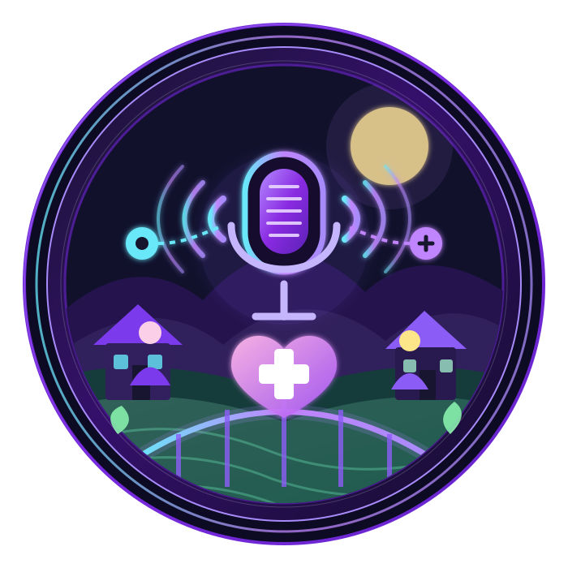

<!-- ========================================================= -->
<!--                    SWASTHYASETU README                    -->
<!-- ========================================================= -->

<div align="center">


<br>

<!-- PROJECT LOGO -->



<br><br>


<br>


<br><br>

<strong>Patient ki language mein suno → samjho → doctor tak pahunchao → doctor ki advice patient ki language mein wapas samjhao.</strong>

</div>

---

# 🌾 SwasthyaSetu

> **SwasthyaSetu – Smart Voice-First Rural Healthcare Platform**

SwasthyaSetu is a **voice-first rural healthcare platform** designed around one simple idea:

### 🗣️ Healthcare should not become difficult just because a patient cannot type.

Many rural patients may face multiple barriers while accessing healthcare:

- 🏥 Limited access to doctors and specialists
- 🛣️ Long distance to hospitals and PHCs
- 📶 Unreliable or limited internet connectivity
- 📱 Limited smartphone familiarity
- 📝 Difficulty typing symptoms or personal details
- 🌐 Language and regional accent differences
- 📖 Low digital literacy
- 💊 Difficulty understanding prescriptions and dosage instructions
- 📅 Missed follow-ups and appointments
- 🗂️ Lack of organized health records
- 📞 **AI Voice Helpline** – Basic-phone users can access healthcare guidance through a voice-based helpline
- 📡 **Offline Basic Health Precautions** – Essential health, hygiene and safety guidance remains available without internet
- 🏛️ **Government Health Policies & Programmes** – Suggests basic government health policies and public healthcare programmes relevant to users
- 🩺 **Doctor Connectivity** – Helps connect patients with doctors or healthcare facilities for further medical assistance

SwasthyaSetu approaches this problem through a **voice-first, patient-friendly healthcare experience**.

---

# 💡 The Core Idea

Instead of forcing a patient to fill complicated forms, the platform allows the patient to **speak naturally**.

For example:

> 🎙️ **Patient:**  
> “Mera naam Ram Kumar hai, main Barabanki ke ek gaon mein rehta hoon.”

The system can identify relevant information such as:

```text
Name       → Ram Kumar
Location   → Barabanki
Context    → Rural village
Input      → Natural voice
```

The patient can then confirm the extracted information.

Similarly:

> 🎙️ **Patient:**  
> “Mujhe teen din se bukhar hai aur raat mein bahut zyada thand lagti hai.”

Instead of requiring the patient to type:

```text
Complaint:
Duration:
Symptoms:
Severity:
```

the platform is designed around **natural conversation**.

---

# 🎯 Vision

<div align="center">

### 🌍 Make healthcare communication simpler, more accessible and more human.

</div>

SwasthyaSetu aims to create a bridge between:

```text
          RURAL COMMUNITY
                 │
                 │
                 ▼
        🎙️ NATURAL VOICE
                 │
                 ▼
       🧠 AI-ASSISTED UNDERSTANDING
                 │
                 ▼
       🗂️ STRUCTURED HEALTH DATA
                 │
                 ▼
       👨‍⚕️ HEALTHCARE PROFESSIONAL
                 │
                 ▼
       💊 GUIDANCE / ADVICE
                 │
                 ▼
       🔊 VOICE RESPONSE
                 │
                 ▼
          👩‍🌾 PATIENT
```

---

# 🚨 The Problem

Traditional digital healthcare systems often assume that the user can:

```text
Read
  ↓
Understand
  ↓
Type
  ↓
Navigate
  ↓
Submit Forms
  ↓
Interpret Results
```

For a rural patient with limited digital literacy, this can become a significant barrier.

### Major Challenges

| Challenge | Real-world Impact |
|---|---|
| 📱 Digital literacy | Complicated apps become difficult to use |
| 📝 Typing | Symptoms are difficult to describe |
| 🌐 Language | Interfaces may not match local language |
| 🗣️ Accent | Speech recognition may need regional adaptation |
| 📶 Connectivity | Cloud-only systems may become inaccessible |
| 🏥 Distance | Specialist access may require travel |
| 🗂️ Records | Patient history may be fragmented |
| 💊 Medication instructions | Dosage/precautions can be misunderstood |
| 📅 Follow-ups | Important healthcare steps can be missed |

---

---

# 🧠🌾 Community Disease Detection & Health Camp Prediction

SwasthyaSetu can analyze **aggregated and anonymized health data from a particular village or local area** to identify emerging patterns in commonly reported symptoms and health conditions.

Instead of looking only at one patient, the system looks at the **community-level pattern**.

For example, if many patients from the same area report:

```text
🌡️ Fever
🤧 Cough
😷 Respiratory Symptoms
```

within a similar period, SwasthyaSetu can identify the pattern and suggest that a relevant **health awareness / screening camp** may be useful in that area.

> The system provides a community-level early-warning and planning signal. It does not independently declare that an outbreak or confirmed disease exists.

---

## 🔄 Community Disease Detection Flow

```text
👩‍🌾 PATIENT 1 ──┐
                 │
👨‍🌾 PATIENT 2 ──┤
                 │
👩‍🌾 PATIENT 3 ──┤
                 │
👨‍🌾 PATIENT 4 ──┤
                 │
👩‍🌾 PATIENT 5 ──┘
                 │
                 ▼
        🗂️ HEALTH DATA
                 │
                 ▼
      🔐 AGGREGATED DATA
                 │
                 ▼
       📊 COMMUNITY ANALYSIS
                 │
                 ▼
      🧠 DISEASE / SYMPTOM
          PATTERN DETECTION
                 │
                 ▼
        📈 TREND IDENTIFIED
                 │
                 ▼
      🏥 HEALTH CAMP SUGGESTION
                 │
                 ▼
       👨‍⚕️ HEALTH AUTHORITY /
          HEALTHCARE TEAM
                 │
                 ▼
          📢 COMMUNITY
            AWARENESS
```

---

## 📍 Area-Level Health Intelligence

The system can organize information according to geographical/community areas such as:

```text
District
   ↓
Block
   ↓
Village
   ↓
Local Community
```

For each area, aggregated information can be analyzed over a defined period.

Example:

```text
┌────────────────────────────────────┐
│       COMMUNITY HEALTH DATA        │
├────────────────────────────────────┤
│ Area       : Village A             │
│ Period     : Last 14 Days          │
│ Reports    : 126                   │
│                                    │
│ Fever      : 42                    │
│ Cough      : 31                    │
│ Weakness   : 24                    │
│ Skin Issues: 17                    │
└────────────────────────────────────┘
```

The system can then identify which symptoms or health concerns are appearing more frequently in the area.

---

# 📊 From Patient Data to Community Pattern

```text
Individual Reports
       │
       ├── Fever
       ├── Fever
       ├── Cough
       ├── Fever
       ├── Cough
       ├── Fever
       ├── Weakness
       └── Fever
              │
              ▼
       Data Aggregation
              │
              ▼
       Frequency Analysis
              │
              ▼
       Pattern Detection
              │
              ▼
    Community Health Signal
```

The objective is to move from:

> **"One patient has a symptom."**

to:

> **"A noticeable number of people in this area are reporting a similar health concern."**

---

# 🏥 Smart Health Camp Suggestion

Once a significant community-level pattern is detected, SwasthyaSetu can suggest a **relevant health camp or screening activity** to the responsible healthcare team.

Example:

```text
Community Pattern
       │
       ▼
Many respiratory symptoms
       │
       ▼
Community Health Signal
       │
       ▼
Suggested Action
       │
       ▼
🫁 Respiratory Health
   Screening / Awareness Camp
```

Another example:

```text
Repeated reports of
skin-related symptoms
       │
       ▼
Community Health Signal
       │
       ▼
Suggested Action
       │
       ▼
🩺 Skin Health
Screening / Awareness Camp
```

The platform **suggests the type of healthcare activity**; the final decision can remain with the appropriate healthcare authorities or professionals.

---

# 🤖 AI-Assisted Community Analysis

The AI layer can help identify patterns from structured health records.

```text
          HEALTH RECORDS
                │
                ▼
       ┌─────────────────┐
       │ Data Aggregation │
       └────────┬────────┘
                │
                ▼
       ┌─────────────────┐
       │ Pattern Analysis │
       └────────┬────────┘
                │
                ▼
       ┌─────────────────┐
       │ Trend Detection  │
       └────────┬────────┘
                │
                ▼
       ┌─────────────────┐
       │ Community Health │
       │     Signal       │
       └────────┬────────┘
                │
                ▼
       🏥 Camp Suggestion
```

---

# 📅 Time-Based Disease Trends

The system can also compare health reports over time.

```text
Week 1
   ↓
Few reports
   ↓
Week 2
   ↓
Increasing reports
   ↓
Week 3
   ↓
Higher concentration
   ↓
Community Health Signal
```

This can help healthcare teams notice **changes in community-level symptom patterns** earlier.

---

# 🎯 Example Scenario

Imagine a village with 500 households.

During a 2-week period:

```text
Total Health Reports
        ↓
       150
        │
        ├── 52 Fever-related reports
        ├── 38 Cough-related reports
        ├── 29 Respiratory complaints
        └── Other complaints
```

SwasthyaSetu can identify:

```text
📈 Increased respiratory/fever-related
    symptom reporting
```

Instead of giving an individual diagnosis, the platform can generate an administrative suggestion such as:

```text
┌─────────────────────────────────────┐
│      COMMUNITY HEALTH ALERT         │
├─────────────────────────────────────┤
│ Area: Village A                     │
│                                     │
│ Pattern: Fever + Respiratory        │
│          Symptoms                   │
│                                     │
│ Suggested Action:                  │
│ 🏥 Community Screening /            │
│    Awareness Camp                  │
│                                     │
│ Final decision:                    │
│ Healthcare Authority / Professional │
└─────────────────────────────────────┘
```

---

# 🔐 Privacy-Aware Community Analytics

Community-level analysis should avoid exposing individual patient identities.

```text
Individual Patient Data
        │
        ▼
🔐 Protected Records
        │
        ▼
Aggregation
        │
        ▼
Anonymous / Statistical Pattern
        │
        ▼
Community-Level Insight
```

The purpose is to identify **community health patterns**, not to publicly identify individual patients.

---

# 🌾 Community → AI → Health Camp

The complete concept can be summarized as:

```text
       👩‍🌾 👨‍🌾 👩‍🌾 👨‍🌾
        COMMUNITY PATIENTS
                │
                ▼
        🗂️ HEALTH RECORDS
                │
                ▼
        🔐 AGGREGATED DATA
                │
                ▼
        🧠 AI ANALYSIS
                │
                ▼
      📊 COMMUNITY PATTERN
                │
                ▼
       🔍 HEALTH CONCERN
          IDENTIFIED
                │
                ▼
        🏥 CAMP SUGGESTION
                │
                ▼
       👨‍⚕️ PROFESSIONAL /
          AUTHORITY REVIEW
                │
                ▼
       📢 COMMUNITY ACTION
```

### 🌉 The bigger idea

SwasthyaSetu does not only help **one patient at a time**.

It can also use aggregated health information to help healthcare teams understand:

> **"Is there a health concern becoming more common in this community?"**

and potentially support:

> **"What kind of screening or awareness activity could be considered for this area?"**

---

---

# 🌟 Smart Accessibility Features

SwasthyaSetu includes three additional features focused on making healthcare support more accessible for rural communities:

- 📞 AI Voice Helpline
- 📡 Offline Basic Health Precautions
- 🏛️ Basic Government Health Policies & Program Guidance

---

# 📞 1. AI Voice Helpline

> **A voice-based support layer for users who may have limited access to smartphones or digital healthcare applications.**

SwasthyaSetu can provide a voice-based helpline where users can communicate naturally through a phone call instead of depending completely on a smartphone application.

### 🎙️ Working Flow

```text
📞 User Calls
      ↓
🎙️ Voice Helpline
      ↓
🗣️ User Speaks Naturally
      ↓
🎧 Voice Processing
      ↓
🧠 AI Assistance
      ↓
📋 Information Understanding
      ↓
🔊 Voice Response
      ↓
👤 User

# 💜 Our Solution

SwasthyaSetu introduces a **voice-first healthcare interaction layer**.

Instead of:

```text
Patient
  ↓
Read Form
  ↓
Type Information
  ↓
Submit
```

SwasthyaSetu aims for:

```text
Patient
   ↓
🎙️ SPEAK
   ↓
AI-assisted understanding
   ↓
Confirm
   ↓
Structured information
   ↓
Healthcare professional
```

And the return journey becomes:

```text
Doctor / Healthcare Professional
              ↓
        Advice / Guidance
              ↓
       Language Processing
              ↓
          Text + Voice
              ↓
        👩‍🌾 Patient
```

---

# 🎙️ Why Voice-First?

Voice is not just another feature.

For the target users, **voice can become the primary interaction layer**.

### Instead of asking:

> “Can you type your symptoms?”

SwasthyaSetu asks:

> 🎙️ “Aapko kya problem ho rahi hai?”

This changes the interaction model from:

**Form-first → Conversation-first**

---

# 🧑‍🌾 Patient Registration Flow

A patient can speak naturally.

### Example

```text
🎙️ "Mera naam Ram Kumar hai.
Main Barabanki ke ek gaon mein rehta hoon.
Meri age 45 saal hai."
```

The system can process the input into:

```text
┌─────────────────────────────┐
│       PATIENT PROFILE       │
├─────────────────────────────┤
│ Name       : Ram Kumar      │
│ Age        : 45             │
│ Location   : Barabanki      │
│ Input      : Voice          │
└─────────────────────────────┘
```

The user can then confirm the information before it is stored.

---

# 🩺 Voice-Based Health Complaint

A patient may say:

> 🎙️ “Mujhe teen din se bukhar hai aur raat mein bahut zyada thand lagti hai.”

The system can organize the information:

```text
Complaint
   │
   ├── Fever
   │
   ├── Duration
   │      └── 3 days
   │
   └── Additional symptom
          └── Chills at night
```

The purpose is **not to replace a doctor**.

The purpose is to make patient information easier to communicate and organize.

---

# 🌐 Language & Accent Friendly Design

Rural communities are not linguistically uniform.

The same concept may be spoken differently:

```text
Dawai
Dawa
Medicine
औषधि
```

Similarly:

```text
Sugar
Shugar
Suggar
शुगर
```

SwasthyaSetu is designed around the idea of:

```text
Natural Speech
      ↓
Speech Understanding
      ↓
Normalization
      ↓
Structured Information
```

If the system is uncertain:

```text
Patient Voice
     ↓
AI Processing
     ↓
Confidence Check
     ↓
 ┌───────────────┐
 │ High          │
 │ Confidence    │
 └───────┬───────┘
         │
         ▼
      Continue


If uncertain:

     ↓
Confirmation
     ↓
"क्या आपने ___ कहा?"
     ↓
Patient confirms
```

---

# 🧠 AI-Assisted Layer

AI is treated as an **assistive layer**, not as an independent doctor.

### AI can help with:

- 🎙️ Speech understanding
- 📝 Information extraction
- 🌐 Language normalization
- 🗂️ Structuring patient information
- 🔎 Identifying relevant fields
- 📋 Organizing complaints
- 🗣️ Generating understandable responses
- 🔊 Voice response generation
- ⚠️ Flagging information that needs human review

### Human healthcare professionals remain important.

```text
                AI
                │
        ┌───────┴───────┐
        │               │
   Understand       Organize
        │               │
        └───────┬───────┘
                │
                ▼
       👨‍⚕️ Healthcare Professional
                │
                ▼
       Clinical Guidance
```

---

# 👨‍⚕️ Patient → Doctor Communication

The complete communication loop:

```text
┌──────────────┐
│   PATIENT    │
└──────┬───────┘
       │
       │ 🎙️ Voice
       ▼
┌──────────────────┐
│ Voice Processing │
└──────┬───────────┘
       │
       ▼
┌──────────────────┐
│ Information      │
│ Extraction       │
└──────┬───────────┘
       │
       ▼
┌──────────────────┐
│ Patient Record   │
└──────┬───────────┘
       │
       ▼
┌──────────────────┐
│ Doctor / Health  │
│ Facility         │
└──────┬───────────┘
       │
       │ Advice
       ▼
┌──────────────────┐
│ Language + Voice │
└──────┬───────────┘
       │
       ▼
┌──────────────┐
│   PATIENT    │
└──────────────┘
```

---

# 🌉 Why "Setu"?

**Setu = Bridge**

SwasthyaSetu is designed as a bridge between:

```text
        RURAL COMMUNITY
               │
               │
               ▼
        🎙️ VOICE ACCESS
               │
               ▼
        🧠 TECHNOLOGY
               │
               ▼
        👨‍⚕️ HEALTHCARE
```

The bridge represents:

### 🗣️ Language  
### 📱 Technology  
### 🏥 Healthcare  
### 🌾 Rural Communities  
### 🤝 Human Connection

---

# 🔄 Complete SwasthyaSetu Flow

```text
                    ┌──────────────────────┐
                    │        PATIENT       │
                    └──────────┬───────────┘
                               │
                               ▼
                    ┌──────────────────────┐
                    │   Choose / Start     │
                    │     Interaction      │
                    └──────────┬───────────┘
                               │
                               ▼
                    ┌──────────────────────┐
                    │    🎙️ Speak Voice    │
                    └──────────┬───────────┘
                               │
                               ▼
                    ┌──────────────────────┐
                    │ Speech Understanding │
                    └──────────┬───────────┘
                               │
                               ▼
                    ┌──────────────────────┐
                    │ Language / Accent    │
                    │    Normalization     │
                    └──────────┬───────────┘
                               │
                               ▼
                    ┌──────────────────────┐
                    │ Information          │
                    │ Extraction           │
                    └──────────┬───────────┘
                               │
                               ▼
                    ┌──────────────────────┐
                    │ Confirmation         │
                    │ & Validation         │
                    └──────────┬───────────┘
                               │
                               ▼
                    ┌──────────────────────┐
                    │ Structured Patient   │
                    │ Information          │
                    └──────────┬───────────┘
                               │
                               ▼
                    ┌──────────────────────┐
                    │ Health Record /      │
                    │ Timeline             │
                    └──────────┬───────────┘
                               │
                               ▼
                    ┌──────────────────────┐
                    │ Doctor / Healthcare  │
                    │ Professional         │
                    └──────────┬───────────┘
                               │
                               ▼
                    ┌──────────────────────┐
                    │ Advice / Prescription│
                    │ / Follow-up          │
                    └──────────┬───────────┘
                               │
                               ▼
                    ┌──────────────────────┐
                    │ Language Adaptation  │
                    └──────────┬───────────┘
                               │
                               ▼
                    ┌──────────────────────┐
                    │ 🔊 Voice Response    │
                    └──────────┬───────────┘
                               │
                               ▼
                    ┌──────────────────────┐
                    │        PATIENT       │
                    └──────────────────────┘
```

---

# 🏗️ High-Level Architecture

```text
                    ┌─────────────────────┐
                    │       USER          │
                    │  Patient / ASHA     │
                    │  Healthcare Worker  │
                    └──────────┬──────────┘
                               │
                               ▼
                 ┌─────────────────────────┐
                 │     VOICE INTERFACE     │
                 │                         │
                 │ 🎙️ Speech Input         │
                 │ 🔊 Voice Output         │
                 └────────────┬────────────┘
                              │
                              ▼
                 ┌─────────────────────────┐
                 │      AI LAYER           │
                 │                         │
                 │ Speech Processing       │
                 │ NLP / Extraction        │
                 │ Language Handling       │
                 │ Response Generation     │
                 └────────────┬────────────┘
                              │
                              ▼
                 ┌─────────────────────────┐
                 │    APPLICATION LAYER    │
                 │                         │
                 │ Patient Management      │
                 │ Health Records          │
                 │ Vitals                  │
                 │ Appointments            │
                 │ Doctor Connectivity     │
                 └────────────┬────────────┘
                              │
                              ▼
                 ┌─────────────────────────┐
                 │      DATA LAYER         │
                 │                         │
                 │ SQLite / Database       │
                 │ Patient Records         │
                 │ Health Timeline         │
                 │ Vitals                  │
                 └─────────────────────────┘
```

---

# 🗂️ Health Data Flow

```text
VOICE
  │
  ▼
┌───────────────────────┐
│ Speech Input          │
└───────────┬───────────┘
            │
            ▼
┌───────────────────────┐
│ Processing            │
└───────────┬───────────┘
            │
            ▼
┌───────────────────────┐
│ Structured Data       │
└───────────┬───────────┘
            │
      ┌─────┴─────┐
      ▼           ▼
   Profile      Complaint
      │           │
      └─────┬─────┘
            ▼
      Health Record
            │
            ▼
       Doctor Review
            │
            ▼
       Health Advice
            │
            ▼
       Voice Response
```

---

# 📋 Patient Health Timeline

The platform can organize important patient information into a timeline.

```text
PATIENT
  │
  ├── 👤 Registration
  │
  ├── ❤️ Vitals
  │
  ├── 🩺 Complaint
  │
  ├── 👨‍⚕️ Consultation
  │
  ├── 💊 Medication / Advice
  │
  ├── 📅 Follow-up
  │
  └── 🔊 Voice Guidance
```

This creates a more structured view of the patient's healthcare journey.

---

# ❤️ Smart Vitals

Vitals can be recorded and organized for easier monitoring.

Example:

```text
┌────────────────────────────┐
│       PATIENT VITALS       │
├────────────────────────────┤
│ Blood Pressure : 120/80    │
│ Pulse          : 78 bpm    │
│ Temperature    : 98.6°F    │
│ SpO₂           : 98%       │
└────────────────────────────┘
```

A status layer can help highlight information requiring attention.

> ⚠️ Such indicators are intended as supportive information and not as a medical diagnosis.

---

# 👩‍⚕️ ASHA / Community Health Support

SwasthyaSetu can also support community-level healthcare workers.

Possible workflow:

```text
             👩‍⚕️ ASHA WORKER
                    │
                    ▼
            Register Patient
                    │
                    ▼
            Record Information
                    │
                    ▼
             Capture Vitals
                    │
                    ▼
             Health Timeline
                    │
                    ▼
             Doctor / PHC
```

This can help connect community-level healthcare activities with organized digital records.

---

# 📢 Announcements

A community healthcare layer can provide important announcements such as:

```text
📢 Vaccination Camp
📢 Health Check-up Camp
📢 PHC Timings
📢 Awareness Program
📢 Community Health Notice
📢 Follow-up Reminder
```

The long-term vision is to make these announcements available through **simple text + voice-based interaction**.

---

# 💼 Rural Jobs & Volunteer Support

Healthcare ecosystems also depend on local community participation.

A future module can connect rural users with:

```text
👩‍⚕️ Healthcare Volunteers
👩‍🌾 Community Workers
🧑‍💻 Digital Support Roles
🏥 Local Healthcare Opportunities
🤝 Volunteer Programs
```

The goal is to expand the platform from a healthcare interface into a broader **community support ecosystem**.

---

# 📶 Connectivity-Aware Design

Internet availability can be inconsistent in rural areas.

Therefore, the architecture is designed with the concept of:

```text
              USER
                │
                ▼
       ┌────────────────┐
       │ Local Interface│
       └───────┬────────┘
               │
        ┌──────┴──────┐
        │             │
     ONLINE         LIMITED
        │          CONNECTIVITY
        │             │
        ▼             ▼
     SERVER        LOCAL DATA
        │             │
        └──────┬──────┘
               │
               ▼
          SYNC WHEN
          AVAILABLE
```

The long-term objective is to reduce dependence on continuous connectivity.

---

# 🔐 Privacy & Security

Healthcare information is sensitive.

Therefore, the project considers:

- 🔐 Authentication
- 🛡️ Access control
- 🗂️ Controlled health-record access
- 🔒 Secure data handling
- 🧹 Minimal unnecessary data collection
- 🎙️ Controlled voice-data handling
- 🧾 Activity logging
- 🏥 Role-based healthcare access

### Security mindset

```text
Patient
   │
   ▼
Authentication
   │
   ▼
Authorization
   │
   ▼
Health Data
   │
   ▼
Controlled Access
```

---

# 🧑‍🤝‍🧑 Human-Centered Design

SwasthyaSetu is designed around the assumption that:

> **Technology should adapt to the user — not force the user to adapt to technology.**

### Traditional approach

```text
Technology
    ↓
Complex Interface
    ↓
User adapts
```

### SwasthyaSetu approach

```text
User
  ↓
Natural Language
  ↓
Voice
  ↓
Technology adapts
```

---

# 🎨 Design Philosophy

The interface focuses on:

### 🟣 Simplicity
Large, understandable actions.

### 🎙️ Voice-first interaction
Reduce dependence on typing.

### 🌐 Language accessibility
Support natural communication.

### ❤️ Human-centered healthcare
Keep healthcare professionals involved.

### 📱 Low digital literacy
Avoid unnecessary complexity.

### 👀 Visual clarity
Use clear icons, cards and readable information.

### 🔐 Privacy-aware design
Treat healthcare information carefully.

---

# 🧩 Core Modules

```text
                    SWASTHYASETU
                         │
       ┌─────────────────┼─────────────────┐
       │                 │                 │
       ▼                 ▼                 ▼
   👤 Patient        🎙️ Voice          🏥 Healthcare
   Management        Interface          Connectivity
       │                 │                 │
       ├────────────┐    ├────────────┐    │
       ▼            ▼    ▼            ▼    ▼
    Profile       Vitals Speech     Language Doctor
                              
       ┌────────────────────────────────────┐
       │              AI LAYER              │
       └────────────────────────────────────┘
                         │
       ┌─────────────────┼──────────────────┐
       ▼                 ▼                  ▼
   🗂️ Records       📢 Community       💼 Support
                     Announcements       Modules
```

---

# 🛠️ Technology Stack

## Frontend

```text
HTML5
CSS3
JavaScript
Responsive UI
```

## Backend

```text
Python
Flask
```

## Database

```text
SQLite
```

## AI / Voice Layer

Potential technologies include:

```text
Speech Recognition
Natural Language Processing
Language Normalization
Text-to-Speech
AI-assisted Information Extraction
```

## Development

```text
VS Code
Git
GitHub
Python Virtual Environment
```

---

# 🏗️ Technical Architecture

```text
┌─────────────────────────────────────────────────┐
│                  PRESENTATION                   │
│                                                 │
│  Patient UI | Voice UI | Doctor UI | Dashboard │
└───────────────────────┬─────────────────────────┘
                        │
                        ▼
┌─────────────────────────────────────────────────┐
│                 APPLICATION                     │
│                                                 │
│ Flask Routes | Patient Management | Vitals      │
│ Health Timeline | Appointments | Records        │
└───────────────────────┬─────────────────────────┘
                        │
                        ▼
┌─────────────────────────────────────────────────┐
│                  AI / VOICE                     │
│                                                 │
│ Speech → Text → NLP → Structured Information   │
│ Text → Language → Speech                        │
└───────────────────────┬─────────────────────────┘
                        │
                        ▼
┌─────────────────────────────────────────────────┐
│                    DATA                         │
│                                                 │
│ SQLite Database | Patient Data | Vitals         │
│ Health Timeline | Healthcare Records            │
└─────────────────────────────────────────────────┘
```

---

# 📁 Project Structure

```text
SwasthyaSetu/
│
├── app.py
├── database.py
├── database.db
├── requirements.txt
├── README.md
│
├── assets/
│   └── swasthya-setu-logo.svg
│
├── templates/
│   ├── base.html
│   ├── index.html
│   ├── register.html
│   ├── patients.html
│   ├── patient_details.html
│   └── vitals.html
│
└── static/
    ├── css/
    ├── js/
    └── images/
```

> The structure above represents the intended application organization. Additional files/modules may be added as development progresses.

---

# 🚀 Development Roadmap

```text
PHASE 01
████████████████████  Foundation

✔ Flask Application
✔ Database Setup
✔ Patient Management
✔ Patient Records
✔ Vitals
✔ Health Timeline
```

```text
PHASE 02
████████████████░░░░  Healthcare Workflow

⬜ ASHA Support
⬜ Doctor Module
⬜ Appointments
⬜ Prescriptions
⬜ Complete Health History
```

```text
PHASE 03
████████████░░░░░░░░  Voice + AI

⬜ Voice Registration
⬜ Voice Complaint
⬜ Speech Processing
⬜ Language Normalization
⬜ AI-assisted Extraction
⬜ Voice Response
```

```text
PHASE 04
████████░░░░░░░░░░░░  Community Layer

⬜ Announcements
⬜ Jobs
⬜ Volunteer Support
⬜ Community Analytics
```

```text
PHASE 05
██████░░░░░░░░░░░░░░  Resilience + Security

⬜ Authentication
⬜ Role-based Access
⬜ Offline Support
⬜ PWA
⬜ Secure Deployment
```

---

# 🧪 Example User Journey

### Step 1 — Patient opens SwasthyaSetu

```text
👩‍🌾 "Mujhe apni health problem batani hai."
```

### Step 2 — Press microphone

```text
🎙️ Listening...
```

### Step 3 — Patient speaks naturally

```text
"Mujhe teen din se bukhar hai
aur raat ko bahut thand lagti hai."
```

### Step 4 — System structures information

```text
Complaint → Fever
Duration  → 3 days
Symptom   → Chills
```

### Step 5 — Patient confirms

```text
"Yes, this is correct."
```

### Step 6 — Information reaches healthcare workflow

```text
Patient
   ↓
Health Record
   ↓
Doctor / Healthcare Professional
```

### Step 7 — Healthcare professional responds

```text
Advice
+
Precautions
+
Medication information
+
Follow-up
```

### Step 8 — Patient receives understandable response

```text
Text + Voice
```

---

# 🌾 Rural Community Scenario

Imagine a patient in a village who has difficulty typing and is more comfortable speaking in their local language.

Instead of navigating multiple forms:

```text
Name?
Age?
Address?
Complaint?
Duration?
Symptoms?
```

the patient can interact through natural speech.

```text
             🎙️
        "Mujhe ye problem
         ho rahi hai..."
                │
                ▼
       ┌─────────────────┐
       │   SWASTHYASETU  │
       └────────┬────────┘
                │
                ▼
       Structured Information
                │
                ▼
        👨‍⚕️ Healthcare
                │
                ▼
          Advice / Guidance
                │
                ▼
              🔊
         Patient hears
        understandable
           response
```

---

# ⭐ What Makes SwasthyaSetu Different?

The project's central differentiator is not simply:

> "We built a healthcare website."

Instead, the focus is:

```text
Healthcare
    +
Voice
    +
Language Accessibility
    +
Rural Context
    +
Human Healthcare Professionals
    +
Organized Records
```

### The interaction starts with the patient's natural communication.

---

# 🧠 AI Is Not the Doctor

A key design principle of SwasthyaSetu is:

```text
                 AI
                 │
          ┌──────┴──────┐
          │             │
      Understand     Organize
          │             │
          └──────┬──────┘
                 │
                 ▼
          HUMAN EXPERT
                 │
                 ▼
          HEALTHCARE
           GUIDANCE
```

AI can assist with communication and organization.

Healthcare decisions should remain within appropriate human and clinical workflows.

---

# 🔊 Voice-First Interaction Philosophy

SwasthyaSetu follows a simple principle:

> **If a patient can speak their problem, the system should help turn that conversation into useful structured information.**

This means reducing unnecessary:

```text
Typing
Scrolling
Forms
Technical Terms
Complex Navigation
```

and increasing:

```text
Speaking
Listening
Confirmation
Clarity
Accessibility
```

---

# 🌍 Long-Term Vision

The long-term vision of SwasthyaSetu is a connected rural healthcare ecosystem:

```text
                    🌾 COMMUNITY
                         │
          ┌──────────────┼──────────────┐
          │              │              │
          ▼              ▼              ▼
      👩‍🌾 Patient      👩‍⚕️ ASHA      🏥 PHC
          │              │              │
          └──────────────┼──────────────┘
                         │
                         ▼
                   🌉 SWASTHYASETU
                         │
              ┌──────────┼──────────┐
              │          │          │
              ▼          ▼          ▼
            Voice       Records      AI
              │          │          │
              └──────────┼──────────┘
                         │
                         ▼
                  👨‍⚕️ DOCTORS
                         │
                         ▼
                  HEALTHCARE
                   GUIDANCE
```

---

# 📊 Future Possibilities

Future versions can explore:

- 🎙️ Multilingual voice interaction
- 🗣️ Regional accent adaptation
- 🤖 AI-assisted health information extraction
- 👨‍⚕️ Doctor consultation workflow
- 👩‍⚕️ ASHA dashboard
- 📅 Appointment management
- 💊 Prescription management
- 🔊 Voice-based medication instructions
- 📶 Offline-first workflows
- 📱 Progressive Web App
- 🔐 Stronger authentication
- 📈 Community health analytics
- 📢 Local health announcements
- 💼 Rural job and volunteer ecosystem
- 🏥 PHC / healthcare facility integration

---

# 🔐 Security by Design

Security is considered from the beginning rather than added at the end.

### Security priorities

```text
          🔐 AUTHENTICATION
                  ↓
          🛡️ AUTHORIZATION
                  ↓
          🗂️ DATA CONTROL
                  ↓
          🔒 SECURE STORAGE
                  ↓
          📋 AUDIT / LOGGING
```

The platform should follow the principle:

> **Collect only what is necessary, protect what is collected, and provide access according to role and purpose.**

---

# 📱 Accessibility Principles

SwasthyaSetu is designed with the following users in mind:

```text
👩‍🌾 Rural Patient
👴 Elderly User
👩‍⚕️ ASHA Worker
👨‍⚕️ Doctor
🏥 Healthcare Facility
```

The interface should prioritize:

- Large actionable controls
- Clear icons
- Simple wording
- Voice interaction
- Minimal typing
- Confirmation before important actions
- Language flexibility
- Readable health information

---

# 💜 Design Language

SwasthyaSetu follows a modern healthcare + technology visual identity:

```text
PURPLE      → Technology + Trust
CYAN        → Voice + Connectivity
GREEN       → Rural Community + Growth
PINK        → Human Care
DARK        → Modern Digital Infrastructure
```

The visual identity intentionally combines:

```text
🌾 Rural
🎙️ Voice
❤️ Healthcare
🌉 Connection
🤖 Technology
```

---

## 📡 Offline Basic Health Precautions & Guidance

> **SwasthyaSetu works even when internet connectivity is unavailable by providing a small set of pre-stored, basic health precautions and safety guidance.**

### 🌿 What Users Can Access Offline

- 💧 **Hydration & ORS Guidance** – Basic precautions for dehydration and weakness
- 🌡️ **Fever Care** – Basic precautions and warning signs
- 😷 **Cough & Cold Care** – Simple hygiene and precautionary guidance
- 🦟 **Mosquito Prevention** – Measures to reduce mosquito-borne illness risk
- 🧼 **Hygiene & Sanitation** – Handwashing, clean water and food-safety practices
- 🥗 **Basic Nutrition Guidance** – Simple healthy eating and nutrition precautions
- ☀️ **Heat & Weather Safety** – Basic precautions during extreme heat
- 🚨 **Warning Signs** – Guidance on when immediate medical attention should be sought

### 🔄 Offline Working Flow

```text
        👤 User
           │
           ▼
   📱 Open SwasthyaSetu
           │
           ▼
   🌐 Internet Available?
       /           \
     YES            NO
      │              │
      ▼              ▼
Online Guidance   📦 Local
                  Health Guide
                      │
                      ▼
              📖 Basic Precautions
                      │
                      ▼
                🚨 Warning Signs
                      │
                      ▼
              🏥 Seek Medical Care
              when required
---

# 📌 Project Highlights

<div align="center">

| 🌾 Rural Focus | 🎙️ Voice First | 🤖 AI Assisted |
|:---:|:---:|:---:|
| Designed around rural healthcare accessibility | Natural speech as primary interaction | Helps structure and understand information |

| 🌐 Language Friendly | 👨‍⚕️ Human Connected | 📶 Connectivity Aware |
|:---:|:---:|:---:|
| Supports natural language interaction | Designed to connect users with healthcare workflows | Designed with low-connectivity scenarios in mind |

</div>

---

# 🧭 Development Principles

```text
USER FIRST
    ↓
SIMPLICITY
    ↓
ACCESSIBILITY
    ↓
VOICE
    ↓
HUMAN SUPPORT
    ↓
SECURITY
    ↓
SCALABILITY
```

---

## 🏛️ Government Health Policy & Programme Guidance

> **SwasthyaSetu provides users with simple, easy-to-understand information about basic government health policies and public healthcare programmes relevant to their needs.**

### 📋 What This Feature Provides

- 🏥 **Basic Public Healthcare Programmes** – Simple information about government healthcare initiatives
- 💉 **Immunization Programmes** – Basic awareness about government vaccination programmes
- 👩‍🍼 **Maternal & Child Health Programmes** – General information about relevant public health initiatives
- 🧑‍⚕️ **Primary Healthcare Initiatives** – Information about government-supported primary healthcare services
- 🧠 **Public Mental Health Programmes** – Basic information about government mental-health initiatives
- 📑 **Government Health Schemes & Policies** – Simple explanations of relevant policies and programmes

### 🔄 How It Works

```text
👤 User
   │
   ▼
🎙️ Voice / Text Query
   │
   ▼
🔎 Understand User's Requirement
   │
   ▼
🏛️ Match with Relevant Government
   Health Policy / Programme
   │
   ▼
📖 Show Simple Explanation
   │
   ├── 📋 Programme / Policy
   ├── 🎯 Purpose
   ├── 👥 Intended Beneficiaries
   └── 🔗 Official Information Source

# ⚠️ Healthcare Disclaimer

SwasthyaSetu is a **technology and healthcare-access project**.

It is not intended to independently diagnose diseases, replace doctors, or make autonomous clinical decisions.

AI-generated or system-generated information should be treated as **assistive information** and should be reviewed through appropriate healthcare workflows.

For real medical emergencies, users should contact appropriate emergency or healthcare services.

---

# 👥 Team

<div align="center">

### Built with ❤️ for our first hackathon

**SwasthyaSetu Team**

🌾 Rural Healthcare  
🎙️ Voice Technology  
🤖 AI  
💻 Software Engineering  
❤️ Human-Centered Design

</div>

---

# 🚀 Project Status

SwasthyaSetu is an evolving hackathon project.

The platform is being developed incrementally:

```text
Foundation
    ↓
Patient Management
    ↓
Health Records
    ↓
Vitals
    ↓
Healthcare Workflow
    ↓
Voice Layer
    ↓
AI Assistance
    ↓
Community Ecosystem
    ↓
Offline / PWA / Security
```

---

# 🌉 The Idea in One Line

<div align="center">

## 🎙️ Speak naturally.  
## 🧠 Get understood.  
## 🏥 Connect to healthcare.  
## 🔊 Hear the guidance.

### **SwasthyaSetu — A bridge between rural communities and accessible healthcare.**

</div>

---

# 💜 Final Vision

```text
                   🌾
              RURAL COMMUNITY
                     │
                     │
                     ▼
              🎙️ NATURAL VOICE
                     │
                     ▼
               🧠 AI ASSISTANCE
                     │
                     ▼
               🗂️ HEALTH DATA
                     │
                     ▼
                👨‍⚕️ DOCTOR
                     │
                     ▼
               ❤️ GUIDANCE
                     │
                     ▼
                🔊 VOICE
                     │
                     ▼
                   👩‍🌾
              PATIENT UNDERSTANDS
```

<div align="center">

### 🌾 Technology should not make healthcare harder.

### 🎙️ It should help people be heard.

<br>


</div>
