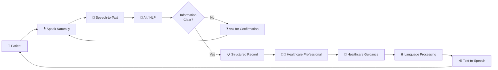
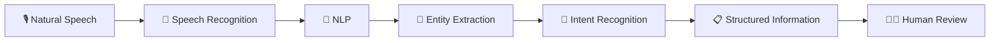
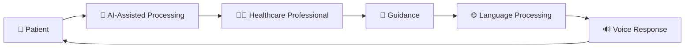
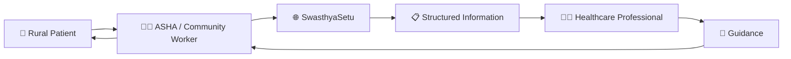
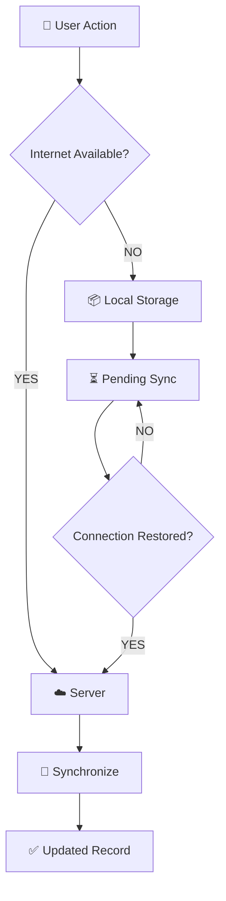
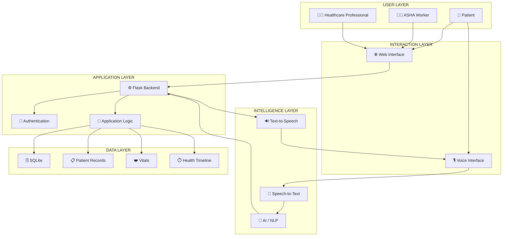
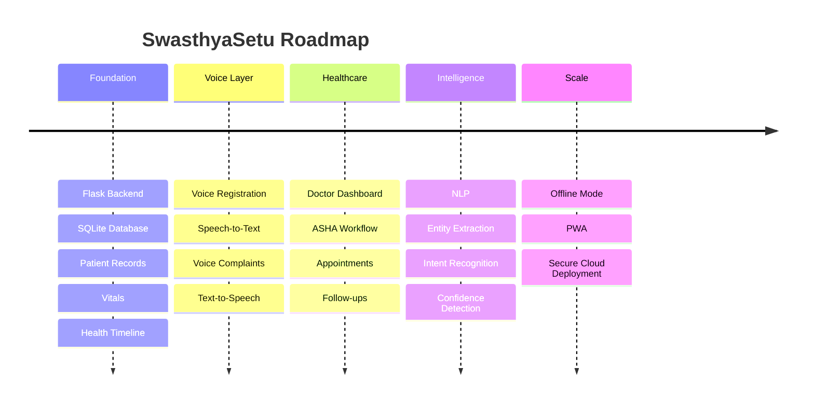

<div align="center">


<br>

<a href="#-the-problem">

</a>

<a href="#-the-solution">

</a>

<a href="#-how-it-works">

</a>

<a href="#-architecture">

</a>

<a href="#-roadmap">

</a>

<br><br>


</div>

<br>

---

<div align="center">

> **Healthcare communication should be accessible before it can be digital.**

</div>

<br>

# 🌾 About SwasthyaSetu

**SwasthyaSetu** is a **Smart Voice-First Rural Healthcare Platform** designed around one simple idea:

> **Let people communicate about their healthcare in a way that feels natural to them.**

The platform explores voice-first interaction for rural communities where typing, complicated interfaces, medical terminology, language differences, and unreliable connectivity can become barriers to digital healthcare.

Instead of making the patient adapt completely to the application, SwasthyaSetu aims to make the interaction **simpler, more accessible, and more human.**

---

# 🚨 The Problem

Rural healthcare access is not only about the physical availability of hospitals.

The **communication layer** itself can become a barrier.

### Common challenges include:

| Challenge | Impact |
|---|---|
| 🏥 Limited access to doctors | Difficult access to timely professional guidance |
| 🛣️ Long travel distances | Additional effort and cost |
| 📶 Unstable connectivity | Difficulty using continuously online systems |
| ⌨️ Typing dependency | Patients may struggle to describe symptoms |
| 📖 Low digital literacy | Complex interfaces can become difficult to navigate |
| 🗣️ Language differences | Formal language may not match everyday communication |
| 🎙️ Accent variations | Speech systems may need regional adaptation |
| 📋 Fragmented information | Patient history may become difficult to organize |
| 💊 Prescription complexity | Instructions may be misunderstood |
| ⏰ Missed follow-ups | Important healthcare interactions may be missed |

---

# 💡 The Solution

SwasthyaSetu introduces a **voice-first communication layer** between rural patients and healthcare professionals.

Instead of asking a user to navigate a long form:

```text
OPEN FORM
    ↓
TYPE INFORMATION
    ↓
SELECT OPTIONS
    ↓
SUBMIT
```

the interaction can move toward:

```text
PRESS 🎙️
    ↓
SPEAK NATURALLY
    ↓
UNDERSTAND
    ↓
STRUCTURE
    ↓
CONFIRM
    ↓
CONNECT
```

### Core principle

<div align="center">

## 🎙️ Listen → 🧠 Understand → 📋 Structure → 👨‍⚕️ Connect → 🔊 Respond

</div>

---

# 🧭 The User Journey



---

# 🎙️ Voice-Based Registration

Instead of filling a long registration form, the user can communicate naturally.

### Example

> **"Mera naam Ram Kumar hai, meri age 52 saal hai aur main Barabanki ke ek gaon mein rehta hoon."**

The system can process relevant information such as:

```text
Name
   ↓
Ram Kumar

Age
   ↓
52

Location
   ↓
Barabanki
```

The extracted information can then be shown to the user for confirmation before being stored.

### Design rule

> **When important information is uncertain, ask for confirmation instead of silently assuming.**

---

# 🩺 Voice-Based Health Complaint

A patient can describe their problem naturally.

### Example

> **"Mujhe teen din se bukhar hai aur raat mein bahut zyada thand lagti hai."**

The system can organize the information into a structured representation:

```yaml
complaint: fever

duration:
  value: 3
  unit: days

additional_information:
  - chills at night
```

The goal is to **improve communication and information organization**.

It is not intended to independently diagnose a patient.

---

# 🌐 Regional Language & Accent Awareness

Healthcare communication does not always happen in standardized language.

SwasthyaSetu is designed with future support for:

- Hindi
- Regional languages
- Local accents
- Mixed-language speech
- Everyday vocabulary
- Pronunciation variations

For example:

```text
Dawai
Dawa
Medicine
```

may represent the same general concept depending on context.

Similarly:

```text
Sugar
Shugar
Suggar
```

may represent speech variations that need contextual interpretation.

The important design principle is:

```text
Uncertain
   ↓
Ask
   ↓
Confirm
   ↓
Store
```

---

# 🧠 AI-Assisted Information Processing

AI is positioned as an **assistive layer**, helping transform natural communication into structured information.



### Potential information categories

- Patient details
- Symptoms
- Duration
- Basic health information
- Medicines
- Follow-up requirements
- Appointment information
- Vitals

---

# 👨‍⚕️ Human-in-the-Loop Healthcare

SwasthyaSetu is designed around a **human-in-the-loop approach**.

AI can assist with:

- Speech processing
- Information extraction
- Language processing
- Structuring patient-reported information

Healthcare professionals remain involved in healthcare decision-making.



---

# 🔊 Voice Response

The communication loop can work in both directions.

```text
PATIENT
   │
   │ speaks
   ▼
🎙️ VOICE
   │
   ▼
🧠 PROCESSING
   │
   ▼
👨‍⚕️ HEALTHCARE PROFESSIONAL
   │
   │ guidance
   ▼
🌐 LANGUAGE PROCESSING
   │
   ▼
🔊 VOICE RESPONSE
   │
   ▼
PATIENT
```

Potential use cases include communicating:

- Medicine instructions
- Dosage information
- Precautions
- Follow-up instructions
- Appointment information

---

# ❤️ Vitals & Health Timeline

The platform can organize basic patient information over time.

### Example

```text
┌──────────────────────────────────────┐
│          PATIENT HEALTH TIMELINE     │
├──────────────────────────────────────┤
│                                      │
│ 👤 Registration                      │
│       │                              │
│       ▼                              │
│ 🎙️ Health Complaint                  │
│       │                              │
│       ▼                              │
│ ❤️ Vitals                            │
│       │                              │
│       ▼                              │
│ 👨‍⚕️ Healthcare Review                 │
│       │                              │
│       ▼                              │
│ 💬 Guidance                          │
│       │                              │
│       ▼                              │
│ 🔁 Follow-up                         │
│                                      │
└──────────────────────────────────────┘
```

### Current prototype supports

- Patient registration
- Patient records
- Vitals recording
- Vitals storage
- Smart vitals status
- Basic health timeline

---

# 👩‍⚕️ Community Health Worker Layer

Community health workers can provide an important bridge for users who need assistance.



Potential workflows include:

- Assisted registration
- Vitals recording
- Patient support
- Follow-up assistance
- Healthcare communication

---

# 📶 Offline-Resilient Vision

Connectivity can vary significantly across locations.

A future architecture can support local storage with synchronization when connectivity returns.



---

# 🔐 Security & Privacy

Healthcare information is sensitive.

A production implementation would require appropriate security and privacy controls.

### Planned security considerations

| Layer | Approach |
|---|---|
| 🔐 Authentication | Secure user authentication |
| 👥 Authorization | Role-based access |
| 🛡️ Patient Records | Controlled access |
| 🔑 Credentials | Secure credential handling |
| 📜 Auditability | Activity logging |
| 🎙️ Voice Data | Responsible data handling |
| 🔒 Infrastructure | Secure deployment practices |

---

# 🏗️ System Architecture



---

# 🧩 Core Modules

<table>
<tr>

<td width="33%" valign="top">

## 🎙️ Voice Layer

- Speech recognition
- Text-to-speech
- Language processing
- Voice interaction

</td>

<td width="33%" valign="top">

## 👤 Patient Layer

- Registration
- Profiles
- Health complaints
- Vitals
- Timeline

</td>

<td width="33%" valign="top">

## 👨‍⚕️ Healthcare Layer

- Doctor access
- ASHA workflows
- Follow-ups
- Healthcare guidance

</td>

</tr>

<tr>

<td valign="top">

## 🧠 Intelligence

- NLP
- Entity extraction
- Intent recognition
- Confidence handling

</td>

<td valign="top">

## 🗄️ Data

- Patient records
- Vitals
- Health timeline
- Interaction history

</td>

<td valign="top">

## 🔐 Security

- Authentication
- Authorization
- Access control
- Auditability

</td>

</tr>

</table>

---

# ✨ Key Features

| Feature | Purpose |
|---|---|
| 🎙️ Voice Interaction | Reduce dependence on typing |
| 👤 Patient Registration | Create structured profiles |
| 🩺 Health Complaints | Capture patient-reported concerns |
| ❤️ Vitals | Record basic health measurements |
| 📋 Health Timeline | Organize patient information |
| 👩‍⚕️ ASHA Support | Enable assisted workflows |
| 👨‍⚕️ Professional Connectivity | Facilitate information sharing |
| 🌐 Language Support | Improve accessibility |
| 📶 Offline Architecture | Handle connectivity constraints |
| 🧠 AI Assistance | Structure natural communication |
| 🔐 Security | Protect sensitive information |

---

# 🛠️ Technology Stack

<div align="center">

| Layer | Technology |
|---|---|
| 🎨 Frontend | HTML5 • CSS3 • JavaScript |
| ⚙️ Backend | Python • Flask |
| 🗄️ Database | SQLite |
| 🧠 Intelligence | AI / NLP |
| 🎙️ Voice | Speech-to-Text |
| 🔊 Response | Text-to-Speech |
| 🔐 Security | Authentication • RBAC |
| 📱 Future | PWA • Offline-first |

</div>

---

# 📂 Project Structure

```text
SwasthyaSetu/
│
├── app.py
├── database.py
├── database.db
├── requirements.txt
├── README.md
│
├── assets/
│   ├── swasthya-setu-logo.svg
│   └── swasthya-setu-hero.svg
│
├── templates/
│   ├── index.html
│   ├── register.html
│   ├── patients.html
│   ├── patient_details.html
│   └── vitals.html
│
├── static/
│   ├── css/
│   │   └── style.css
│   │
│   └── js/
│       └── script.js
│
└── screenshots/
    ├── dashboard.png
    ├── patient-registration.png
    ├── vitals.png
    └── health-timeline.png
```

---

# 🚀 Current Implementation

### Completed

- [x] Flask application setup
- [x] SQLite database
- [x] Patient registration
- [x] Patients list
- [x] Patient details
- [x] Vitals recording
- [x] Vitals database
- [x] Smart vitals status
- [x] Basic health timeline
- [x] Patient record management

### In Development

- [ ] Voice-based registration
- [ ] Voice health complaints
- [ ] Speech-to-text
- [ ] Text-to-speech
- [ ] Regional language support
- [ ] Doctor dashboard
- [ ] ASHA workflow
- [ ] Appointments
- [ ] Prescriptions
- [ ] Authentication
- [ ] Offline synchronization
- [ ] AI-assisted information extraction

---

# 🗺️ Development Roadmap



---

# 📸 Interface

> Add screenshots of the **actual implemented application** here as the project evolves.

<div align="center">

### 🏠 Dashboard


<br><br>

### 👤 Patient Registration


<br><br>

### ❤️ Vitals


<br><br>

### 📋 Health Timeline


</div>

---

# 💻 Getting Started

## 1. Clone the repository

```bash
git clone https://github.com/anshika-dev23/Swasthya-Setu.git
cd Swasthya-Setu
```

## 2. Create a virtual environment

### macOS / Linux

```bash
python3 -m venv venv
source venv/bin/activate
```

### Windows

```bash
python -m venv venv
venv\Scripts\activate
```

## 3. Install dependencies

```bash
pip install -r requirements.txt
```

## 4. Run the application

```bash
python app.py
```

Open:

```text
http://127.0.0.1:5000
```

---

# 🧪 Example Interaction

### 👤 Patient

> **"Mujhe teen din se bukhar hai aur raat mein bahut thand lagti hai."**

### 🎙️ Voice Layer

```text
Speech
 ↓
Speech-to-Text
```

### 🧠 Intelligence Layer

```text
Complaint → Fever
Duration → 3 Days
Additional → Chills at night
```

### 👨‍⚕️ Healthcare Professional

Reviews the available information and provides appropriate healthcare guidance.

### 🔊 Response Layer

The guidance can be transformed into an accessible voice interaction.

---

# 🌱 Future Vision

SwasthyaSetu can evolve into a broader rural healthcare communication ecosystem.

```mermaid
mindmap

root((🌾 SwasthyaSetu))

  🎙️ Voice
    Speech Recognition
    Text-to-Speech
    Regional Languages
    Accent Awareness

  👨‍⚕️ Healthcare
    Doctors
    ASHA Workers
    Appointments
    Follow-ups
    Prescriptions

  🧠 Intelligence
    NLP
    Entity Extraction
    Intent Recognition
    Confidence Detection

  📶 Accessibility
    Offline Mode
    PWA
    Low Bandwidth
    Simple Interface

  🔐 Trust
    Authentication
    Authorization
    Secure Records
    Audit Logs
```

---

# ⚠️ Responsible Use

SwasthyaSetu is a software prototype focused on healthcare communication and information organization.

It is **not intended to independently diagnose medical conditions or replace qualified healthcare professionals.**

A production implementation would require appropriate:

- Clinical validation
- Privacy safeguards
- Security controls
- Regulatory compliance
- Responsible AI evaluation
- Healthcare professional oversight

---

# 👥 Team

| Member | Contribution |
|---|---|
| **Anshika Srivastava** | Backend • Healthcare Platform • Voice-first Concept |
| Team Member | Add contribution |
| Team Member | Add contribution |
| Team Member | Add contribution |

---

<div align="center">


<br><br>

## 🌾 From Voice to Care.

**Listen. Understand. Connect. Care.**

<br>


<br><br>

**SwasthyaSetu — Smart Voice-First Rural Healthcare Platform**

</div>
